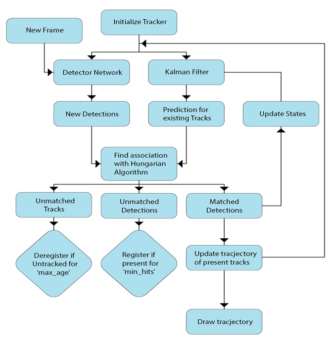

# Multiple-Car-Tracking-using-YOLOv5
This is a Multi object tracker. Mainly it was built for tracking car movement in a junction. It will track each car with unique ID from entering a junction until leaving to another junction. In this pipeline, the yolov5 is used as detector. Vehicle entering the junction until leaving it will be tracker with smoothed contrail and a unique ID. Contrail is smoothed using exponential mean average over the real output. Multiple colors depict the multiple car possessing a unique ID.
This was extra task of this year Video and Image Processing Cup organized by IEEE SPS. We team 'BUET Synapticans' stood 1st in the competition and this was our winning solution for the extra task. Details about the competition can be found [here](https://signalprocessingsociety.org/community-involvement/video-image-processing-cup) 

Demo of the task:


# Defishing
To defish (to get rid of radial distortion) a fisheye image one can execute the section of 'Defishing'. A folder containing all fisheye images can be defished by executing 'main.py' in defishing folder. Dataset format is in the 'Euclidean Distance Based Car Tracker' section. A video will be saved containing all defished images.

# Euclidean Distance Based Car Tracker
Run 'object_trackerV1.py' to execute Euclidean Distance based car tracker. Here euclidean distance is used for distance comparison between points.


# SORT Car Tracker with contrail
SORT (Simple Online and Real-time Tracking) is one of the most popular algorithms for object tracking in higher fps. As car detector we have used YoloV5. It performs at higher fps with better accuracy adjusting the tradeoff. The whole pipeline can be summarized as:




To organize one can follow the structure after creating new input forlder 'images' as:
```
images/
     img1.jpg
     img2.jpg
     img3.jpg
     img4.jpg
     ...

```

# Implementation :
After organizing the dataset(mentioned above) one can run the SORT algorithm for car tracking:
```bash
python main.py
```

# Dependencies:
To install required dependencies run:
```bash
pip install -r track_requirements.txt
```
# Evaluation Script :
TODO

# References 
* https://github.com/ultralytics/yolov5
* https://www.pyimagesearch.com/2018/07/23/simple-object-tracking-with-opencv/
* To implement different type of Distance measuring algorithms : https://docs.scipy.org/doc/scipy/reference/generated/scipy.spatial.distance.cdist.html
* Simple Online and Realtime Tracking by Bewley et al
